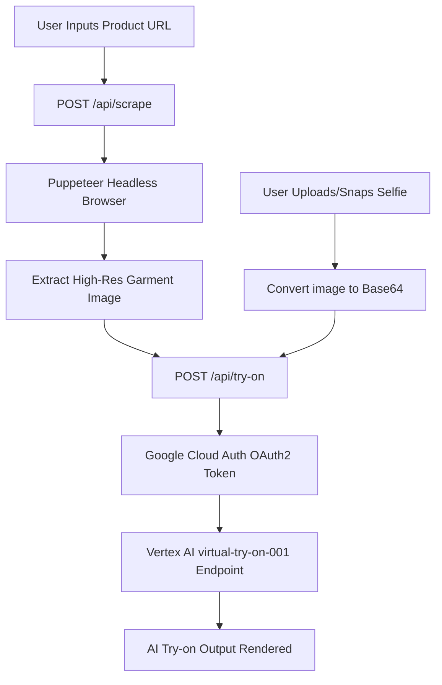

# 👕 FitCheck.AI — Virtual Fitting Room & AI Try-On

FitCheck.AI is a premium, modern web application built using **Next.js 16**, **React 19**, and **Tailwind CSS v4** that acts as your personal virtual dressing room. Simply paste a product URL from your favorite e-commerce store and upload or snap a photo of yourself. The system automatically extracts the clothing item and merges it onto you using state-of-the-art AI.


## ✨ Features

- **🔗 Smart URL Scraper**: Instantly extracts high-resolution garment images from online shopping sites (including custom heuristics for Amazon, Flipkart, Myntra, and open-graph fallbacks) using a serverless Puppeteer crawler.
- **📸 Snapshot Capture & Upload**: Upload an image or capture a snapshot instantly using your webcam with mirrored-video alignment controls.
- **🔮 Vertex AI Try-On Pipeline**: Powered by Google Cloud's `virtual-try-on-001` model, producing high-fidelity virtual fittings with realistic folds, shadows, and fabric drape.
- **✨ Premium UX/UI Design**: Fluid layout transitions, active micro-animations powered by `framer-motion`, and a clean, high-contrast dark/light responsive interface.
- **🔒 Secure & Protected**: Designed to run environment-isolated. No API keys or service account credentials are saved to Git.
- **📊 Analytics Dashboard**: A passcode-secured backend dashboard at `/dashboard` to view statistics (usage count, success rate, mode splits) and inspect past try-ons side-by-side.
- **☁️ Silent GCS Logging**: All try-on actions and images are silently tracked and archived to Google Cloud Storage (GCS) with zero latency impact to the frontend user interface.

---

## 🛠️ Tech Stack

- **Framework**: [Next.js 16 (App Router)](https://nextjs.org/)
- **UI & Components**: React 19, [Lucide React](https://lucide.dev/) (icons), [Framer Motion](https://www.framer.com/motion/) (animations)
- **Styling**: [Tailwind CSS v4](https://tailwindcss.com/)
- **Web Scraping Engine**: [Puppeteer](https://pptr.dev/) (headless browser engine)
- **AI Processing**: Google Cloud Vertex AI REST APIs (`virtual-try-on-001` model)
- **Security**: Official Google Auth libraries (`google-auth-library`)

---

## 📐 How it Works (Under the Hood)



1. **Extraction**: When a product URL is entered, a serverless Puppeteer script navigates to the page, simulates a real desktop user, and runs custom DOM parsing strategies for major stores to find the primary high-res clothing image.
2. **Authentication**: The `/api/try-on` endpoint initiates a secure authorization flow with Google Cloud Platform using your local credentials file.
3. **Synthesis**: The server calls the Vertex AI Endpoint (`virtual-try-on-001:predict`) with base64 encoded strings of both the person and the garment, returning the newly synthesized try-on image.

---

## 🚀 Getting Started & Local Setup

### Prerequisites

- [Node.js (v18.x or newer)](https://nodejs.org/)
- A **Google Cloud Platform (GCP)** project with the **Vertex AI API** enabled.

### 1. Clone & Install Dependencies
```bash
git clone https://github.com/dhyanivj/fitcheck.Ai.git
cd fitcheck.Ai
npm install
```

### 2. Configure Environment Variables
Copy the env example template to create your local configurations:
```bash
cp .env.example .env.local
```

Open `.env.local` and fill in your details:
```env
# Path to your local Google Cloud Service Account key JSON file
GOOGLE_APPLICATION_CREDENTIALS="/path/to/your/gcp-key.json"

# Your Google Cloud Project ID
GOOGLE_CLOUD_PROJECT="your-gcp-project-id"

# Region where Vertex AI models are deployed (e.g. us-central1)
GOOGLE_CLOUD_LOCATION="us-central1"

# Dashboard passcode (Required for the analytics dashboard at /dashboard)
DASHBOARD_PASSCODE="your-passcode"

# Google Cloud Storage Bucket (Optional: defaults to [GOOGLE_CLOUD_PROJECT]-source-bucket)
# GOOGLE_CLOUD_STORAGE_BUCKET="your-gcs-bucket-name"
```

> [!IMPORTANT]
> Never commit your `.env.local` or GCP service account keys to Git. The `.gitignore` file is pre-configured to block pushing files matching `.env*` (except `.env.example`).

### 3. Run the Development Server
```bash
npm run dev
```
Open [http://localhost:3000](http://localhost:3000) with your browser to experience the virtual dressing room locally.

---

## 📦 Scripts

- `npm run dev` — Starts the development server with Turbopack compilation.
- `npm run build` — Generates an optimized production build.
- `npm run start` — Starts the built Next.js application in production mode.
- `npm run lint` — Runs ESLint checks to enforce code quality.
- `npm run deploy` — Compiles and redeploys the application container directly to Google Cloud Run.

## 🤝 Contributing
Contributions, issues, and feature requests are welcome! Feel free to open a pull request or submit feedback.

## 📄 License
Distributed under the MIT License. See [LICENSE](LICENSE) for more information.

---
Developed with ❤️ by [Vijay Dhyani](https://dhyani.site)
